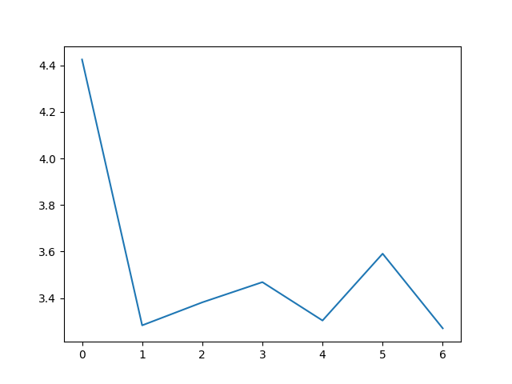
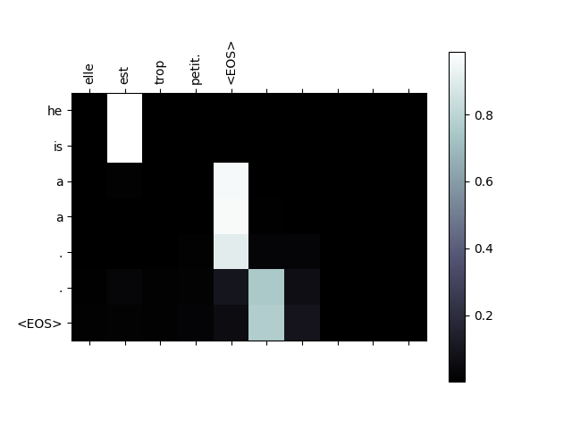

# pytorch实验
## rainbow鱼 🐋✨

---

### [exp2](exp2)
全连接神经网络
```python
class Net(nn.Module):
    def __init__(self):
        super(Net, self).__init__()
        self.fc1 = nn.Linear(784, 512)
        self.relu1 = nn.ReLU()
        self.fc2 = nn.Linear(512, 512)
        self.relu2 = nn.ReLU()
        self.fc3 = nn.Linear(512, 10)

    def forward(self, x):
        x = x.view(x.size(0), -1)
        x = self.fc1(x)
        x = self.relu1(x)
        x = self.fc2(x)
        x = self.relu2(x)
        x = self.fc3(x)
        return x
```

> 完成FashionMnist的训练，epcho:20，lr:0.01，batch:64

<p align="center">
    
    
</p>

---

### [exp3](exp3)
LeNet5
```python
class LeNet5(nn.Module):
    def __init__(self):
        super(LeNet5, self).__init__()
        self.conv1 = nn.Conv2d(1, 6, 5, 1, 2)
        self.pool = nn.AvgPool2d(2, 2)
        self.conv2 = nn.Conv2d(6, 16, 5, 1)
        self.pool2 = nn.AvgPool2d(2, 2)
        self.fc1 = nn.Linear(16 * 5 * 5, 120)
        self.fc2 = nn.Linear(120, 84)
        self.fc3 = nn.Linear(84, 10)
        self.relu = nn.ReLU()

    def forward(self, x):
        x = self.relu(self.conv1(x))
        x = self.pool(x)
        x = self.relu(self.conv2(x))
        x = self.pool2(x)
        x = x.view(-1, 16 * 5 * 5)
        x = self.relu(self.fc1(x))
        x = self.relu(self.fc2(x))
        x = self.fc3(x)
        return x
```
> 完成Mnist的训练，epcho:10，lr:0.001，batch:64

<p align="center">
    
    
</p>

---

### [exp4](exp4)
猫狗实验 Cats and Dogs

> 详细信息见文件内的[README.md](exp4/README.md)


---

### [exp5](exp5)
股票预测 LSTM

> 详细信息见文件内的[README.md](exp5/README.md)


### [exp6](exp6)
Seq 2 Seq
```python
# 模型定义：编码器
class EncoderRNN(nn.Module):
    def __init__(self, input_size, hidden_size):
        super(EncoderRNN, self).__init__()
        self.hidden_size = hidden_size
        self.embedding = nn.Embedding(input_size, hidden_size)
        self.gru = nn.GRU(hidden_size, hidden_size)

    def forward(self, input_tensor, hidden_tensor):
        embedded = self.embedding(input_tensor).view(1, 1, -1)
        output, hidden = self.gru(embedded, hidden_tensor)
        return output, hidden

    def init_hidden(self):
        return torch.zeros(1, 1, self.hidden_size, device=device)


# 模型定义：基础解码器（无注意力）
class DecoderRNN(nn.Module):
    def __init__(self, hidden_size, output_size):
        super(DecoderRNN, self).__init__()
        self.hidden_size = hidden_size
        self.embedding = nn.Embedding(output_size, hidden_size)
        self.gru = nn.GRU(hidden_size, hidden_size)
        self.out = nn.Linear(hidden_size, output_size)
        self.softmax = nn.LogSoftmax(dim=1)

    def forward(self, input_tensor, hidden_tensor):
        embedded = self.embedding(input_tensor).view(1, 1, -1)
        embedded = F.relu(embedded)
        output, hidden = self.gru(embedded, hidden_tensor)
        output = self.softmax(self.out(output[0]))
        return output, hidden

    def init_hidden(self):
        return torch.zeros(1, 1, self.hidden_size, device=device)


# 模型定义：注意力解码器
class AttnDecoderRNN(nn.Module):
    def __init__(self, hidden_size, output_size, dropout_p=0.1, max_length=MAX_LENGTH):
        super(AttnDecoderRNN, self).__init__()
        self.hidden_size = hidden_size
        self.output_size = output_size
        self.dropout_p = dropout_p
        self.max_length = max_length

        self.embedding = nn.Embedding(self.output_size, self.hidden_size)
        self.attn = nn.Linear(self.hidden_size * 2, self.max_length)
        self.attn_combine = nn.Linear(self.hidden_size * 2, self.hidden_size)
        self.dropout = nn.Dropout(self.dropout_p)
        self.gru = nn.GRU(self.hidden_size, self.hidden_size)
        self.out = nn.Linear(self.hidden_size, self.output_size)

    def forward(self, input_tensor, hidden_tensor, encoder_outputs):
        embedded = self.embedding(input_tensor).view(1, 1, -1)
        embedded = self.dropout(embedded)

        # 计算注意力权重
        attn_weights = F.softmax(
            self.attn(torch.cat((embedded[0], hidden_tensor[0]), 1)), dim=1
        )
        attn_applied = torch.bmm(attn_weights.unsqueeze(0), encoder_outputs.unsqueeze(0))

        # 合并上下文向量和嵌入向量
        output = torch.cat((embedded[0], attn_applied[0]), 1)
        output = self.attn_combine(output).unsqueeze(0)
        output = F.relu(output)

        # 输入GRU层
        output, hidden = self.gru(output, hidden_tensor)
        output = F.log_softmax(self.out(output[0]), dim=1)
        return output, hidden, attn_weights

    def init_hidden(self):
        return torch.zeros(1, 1, self.hidden_size, device=device)
```
> 完成Seq2Sqe的训练，n_iters:750，lr:0.01，hidden_size:256
<p align="center">
    
    
</p>
