### [exp5](exp5)
股票预测 LSTM

> 进行了多个模型和不同参数的对比实验 

---

#### 实验的股票数据:

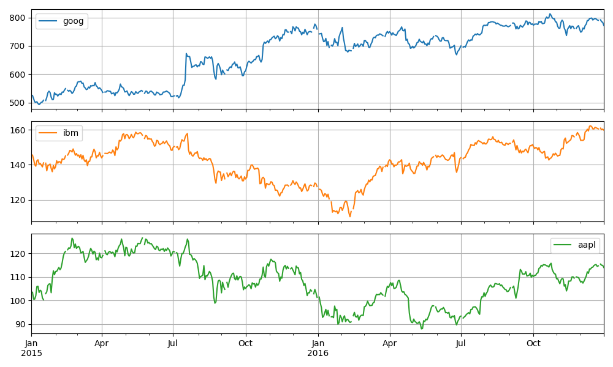

---

#### RNN模型:
- RNN
```python
class RNN(nn.Module):
    def __init__(self, input_dim, hidden_dim, num_layers, output_dim):
        super(RNN, self).__init__()
        self.input_dim = input_dim
        self.hidden_dim = hidden_dim
        self.num_layers = num_layers
        self.output_dim = output_dim

        self.rnn = nn.RNN(input_dim, hidden_dim, num_layers, batch_first=True)
        self.fc = nn.Linear(hidden_dim, output_dim)

    def forward(self, x):
        h0 = torch.zeros(self.num_layers, x.size(0), self.hidden_dim).requires_grad_()
        out, hn = self.rnn(x, h0.detach())
        out = self.fc(out[:, -1, :])
        return out
```

- GRU
```python
class GRU(nn.Module):
    def __init__(self, input_dim, hidden_dim, num_layers, output_dim):
        super(GRU, self).__init__()
        self.input_dim = input_dim
        self.hidden_dim = hidden_dim
        self.num_layers = num_layers
        self.output_dim = output_dim

        self.gru = nn.GRU(input_dim, hidden_dim, num_layers, batch_first=True)
        self.fc = nn.Linear(hidden_dim, output_dim)

    def forward(self, x):
        h0 = torch.zeros(self.num_layers, x.size(0), self.hidden_dim).requires_grad_()
        out, hn = self.gru(x, h0.detach())
        out = self.fc(out[:, -1, :])
        return out
```
- LSTM
```python
class LSTM(nn.Module):
    def __init__(self, input_dim, hidden_dim, num_layers, output_dim):
        super(LSTM, self).__init__()
        self.input_dim = input_dim
        self.hidden_dim = hidden_dim
        self.num_layers = num_layers
        self.output_dim = output_dim

        self.lstm = nn.LSTM(input_dim, hidden_dim, num_layers, batch_first=True)
        self.fc = nn.Linear(hidden_dim, output_dim)

    def forward(self, x):
        h0 = torch.zeros(self.num_layers, x.size(0), self.hidden_dim).requires_grad_()
        c0 = torch.zeros(self.num_layers, x.size(0), self.hidden_dim).requires_grad_()
        out, (hn, cn) = self.lstm(x, (h0.detach(), c0.detach()))
        out = self.fc(out[:, -1, :])
        return out
```

---

#### 参数设置和模型结果对比

| Index | Model | Loss      | Optimizer | Look Back | Dynamic LR | Curve                                                                                    | Prediction                                                                       |
|-------|-------|-----------|-----------|-----------|------------|------------------------------------------------------------------------------------------|----------------------------------------------------------------------------------|
| 1     | LSTM  | MSELoss   | Adam      | 60        | False      | 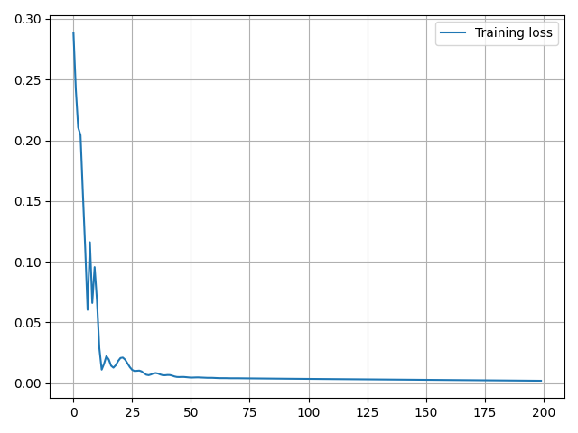    | 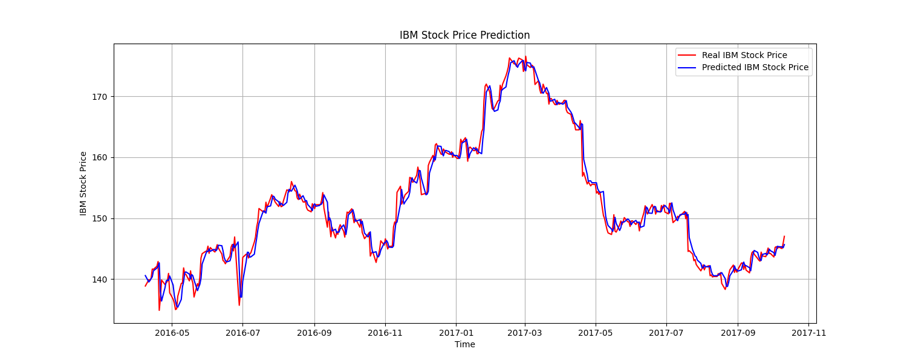    |
| 2     | RNN   | MSELoss   | Adam      | 60        | False      | 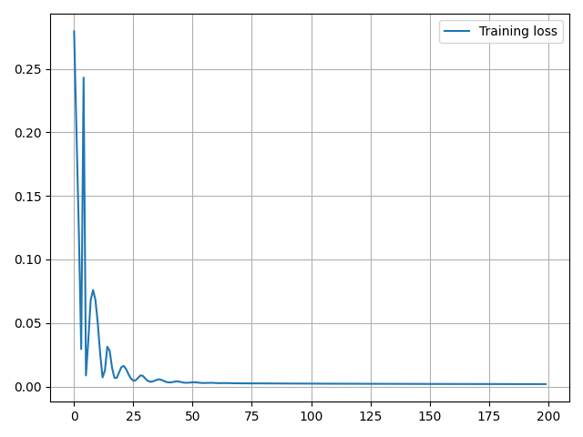     | 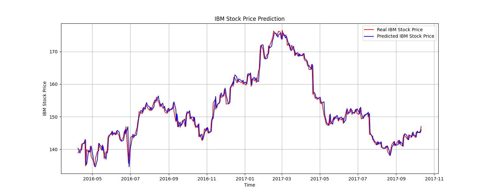     |
| 3     | GRU   | MSELoss   | Adam      | 60        | False      | 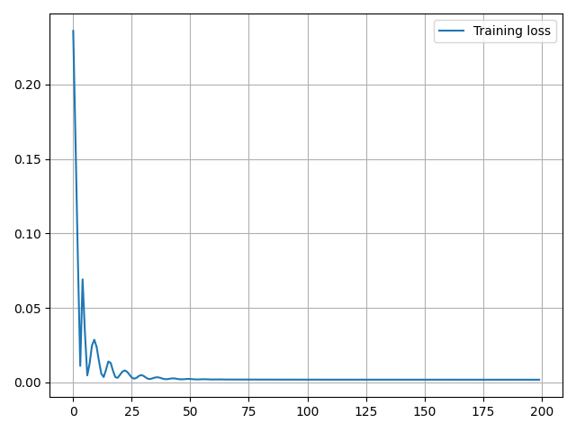     | 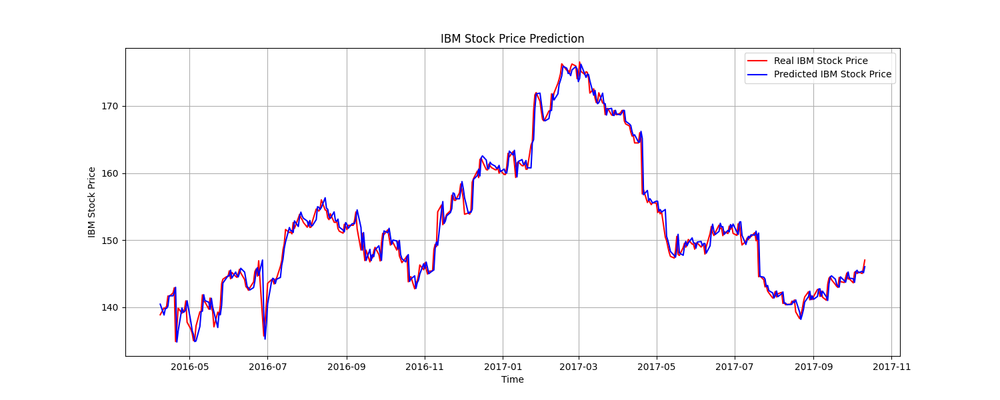     |
| 4     | LSTM  | L1Loss    | Adam      | 60        | False      | 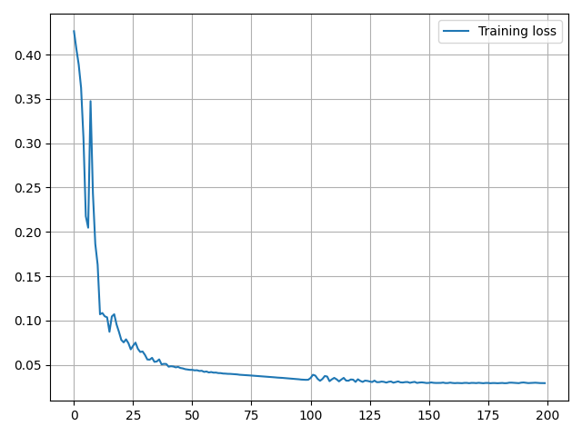     | 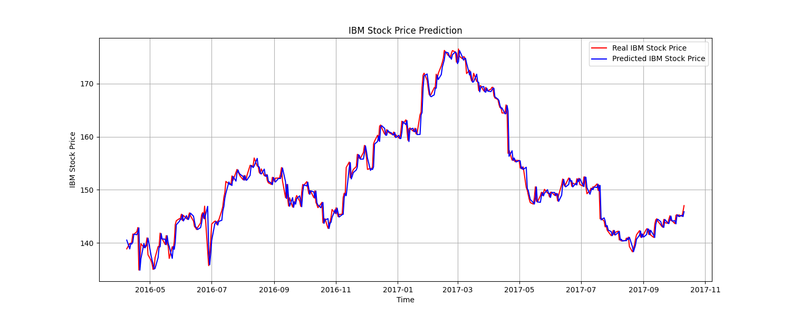     |
| 5     | LSTM  | HuberLoss | Adam      | 60        | False      | 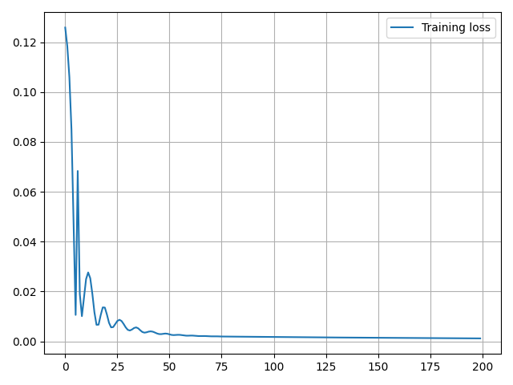  | 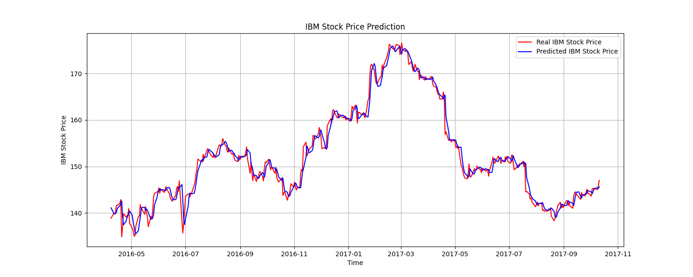  |
| 6     | LSTM  | MSELose   | SGD       | 60        | False      | 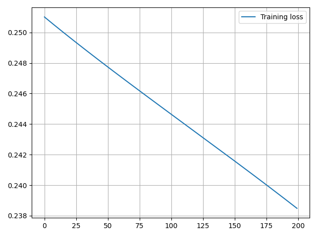     | 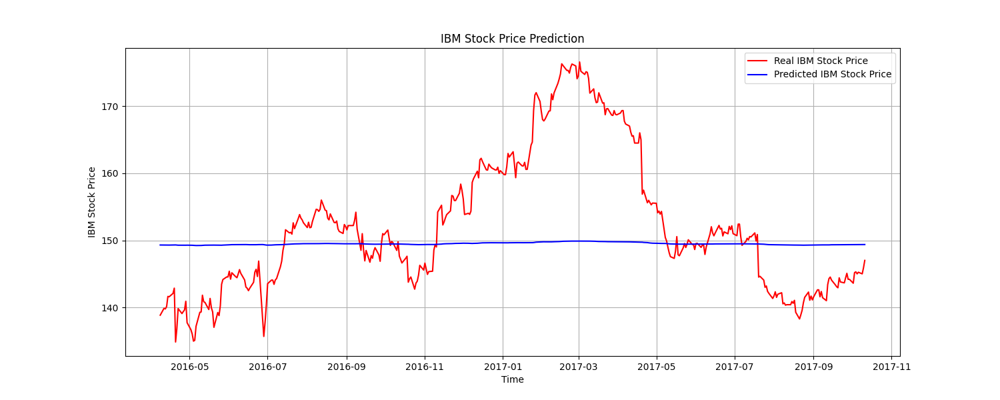     |
| 7     | LSTM  | MSELose   | RMSprop   | 60        | False      | 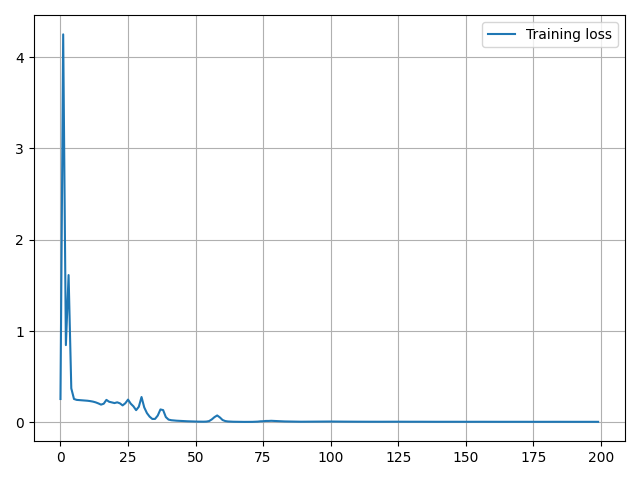 | 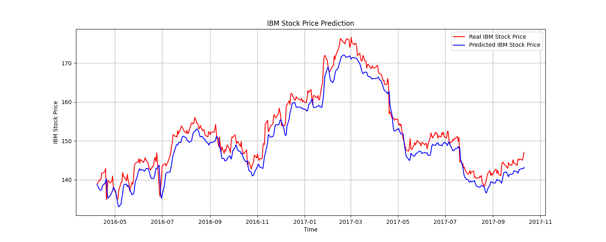 |
| 8     | LSTM  | MSELose   | Adma      | 30        | False      | 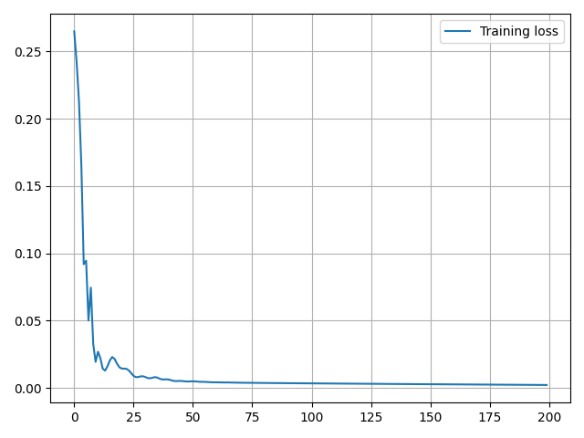    | 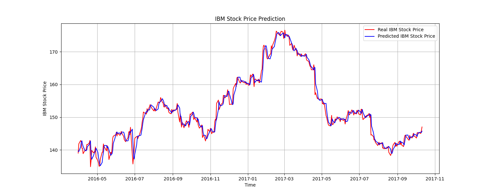    |
| 9     | LSTM  | MSELose   | Adma      | 15        | False      | 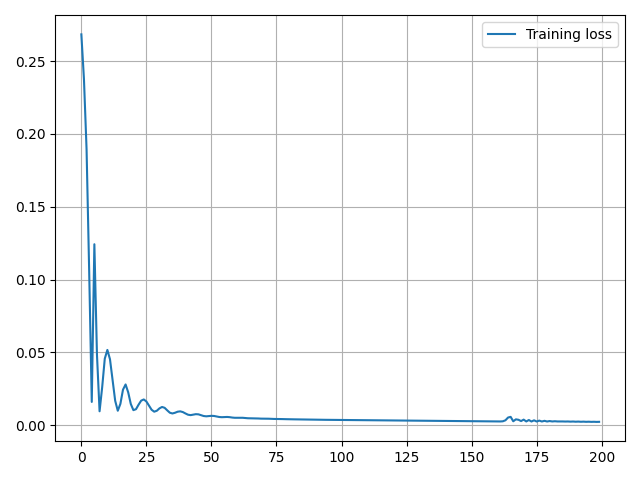    | 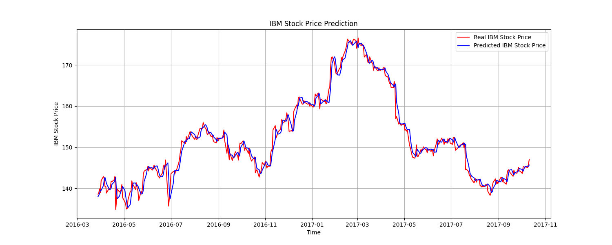    |
| 10    | LSTM  | MSELose   | Adma      | 60        | True       | 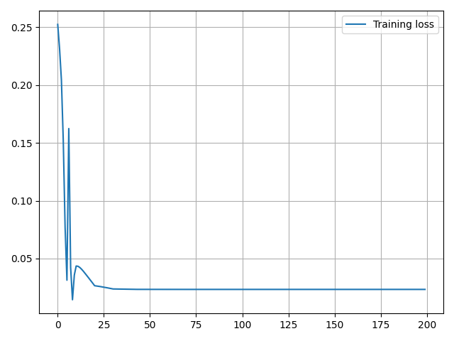     | 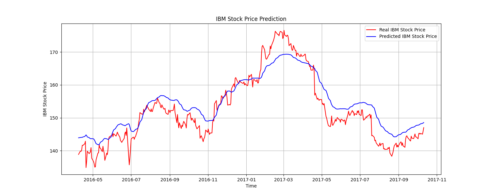                                                                                 |
