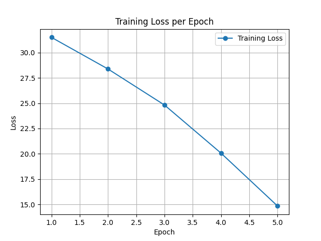
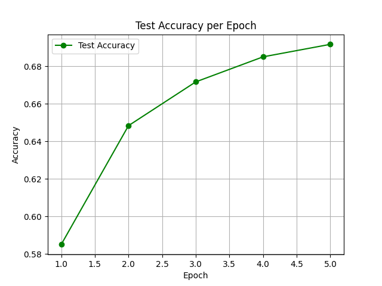
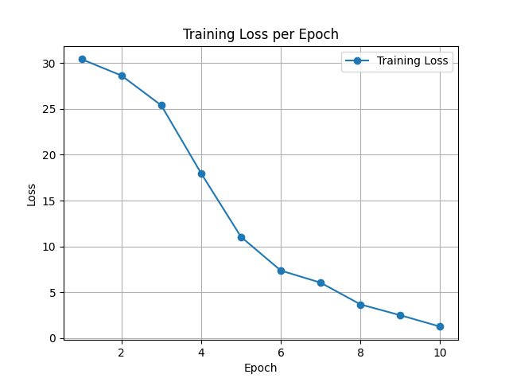
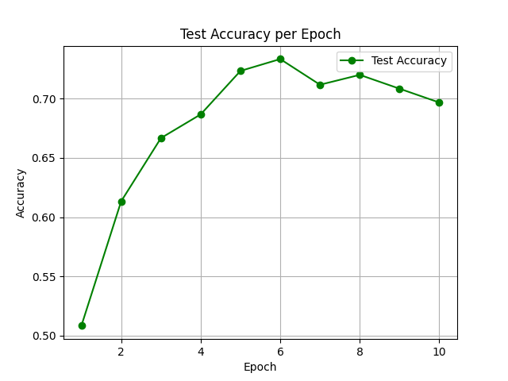
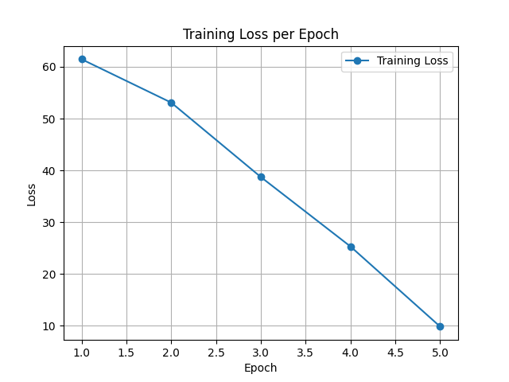
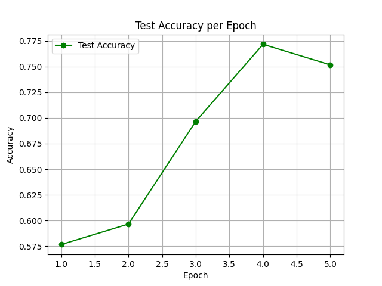
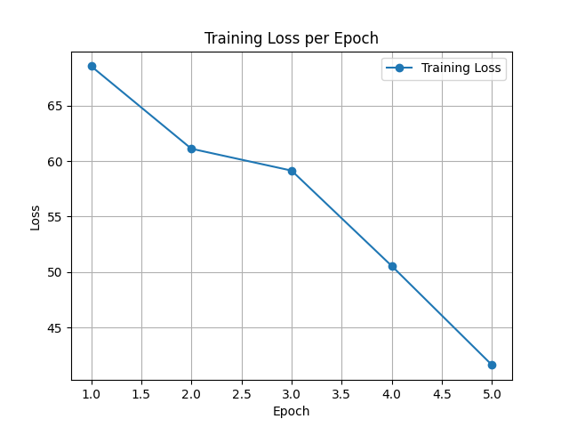
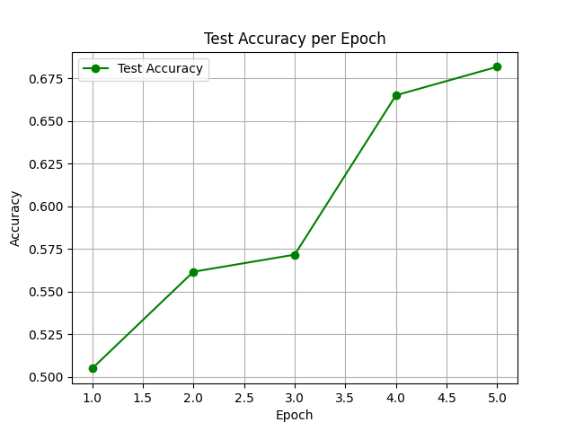

### [exp7](exp7)
基于多头注意力机制的文本分类

> 进行了多个模型和不同参数的对比实验 

---

#### 实验数据:

[IMDB](https://huggingface.co/datasets/stanfordnlp/imdb)数据集

---

#### Transformer模型:
- Transformer
```python
class TransformerClassifier(nn.Module):
    def __init__(self, vocab_size, embed_dim, num_heads, num_classes=2, pad_idx=0):
        super().__init__()
        self.pad_idx = pad_idx
        self.embedding = nn.Embedding(vocab_size, embed_dim)
        self.pos_encoder = PositionalEncoding(embed_dim)
        self.attention = MultiHeadSelfAttention(embed_dim, num_heads)
        self.fc = nn.Sequential(
            nn.LayerNorm(embed_dim),
            nn.Linear(embed_dim, num_classes)
        )

    def forward(self, x):
        mask = (x != self.pad_idx).unsqueeze(1).unsqueeze(2)
        emb = self.embedding(x)
        emb = self.pos_encoder(emb)
        attn_out = self.attention(emb, mask)
        pooled = attn_out.mean(dim=1)
        return self.fc(pooled)
```

- multi head attention
```python
class MHAClassifier(nn.Module):
    def __init__(self, vocab_size, embed_dim, num_heads, num_classes=4):
        super().__init__()
        self.embedding = nn.Embedding(vocab_size, embed_dim)
        self.attn = nn.MultiheadAttention(embed_dim, num_heads, batch_first=True)
        self.linear = nn.Linear(embed_dim, num_classes)
        self.attn_weights = None  # 用于保存注意力权重

    def forward(self, x):
        x = self.embedding(x)  # [B, T, E]
        attn_output, attn_weights = self.attn(x, x, x)
        self.attn_weights = attn_weights  # [B, T, T]
        pooled = attn_output.mean(dim=1)
        return self.linear(pooled)
```

---

#### 参数设置和模型结果对比

| Index | Epochs | num_heads | Attention                   | Loss                                       | Accuracy                                           | 
|-------|--------|-----------|-----------------------------|--------------------------------------------|----------------------------------------------------|
| 1     | 5      | 4         | MHAClassifier               |            |            |
| 2     | 10     | 4         | MHAClassifier               |          |          |                                         |
| 3     | 5      | 8         | MHAClassifier               |        |        |
| 4     | 5      | 8         | torch.nn.MultiheadAttention |  |  |                                             |
